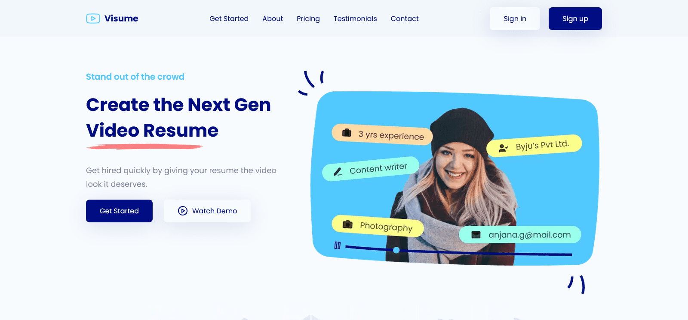

# Video Resume Landing Page

> Original source from 🏀 [Figma](https://www.figma.com/community/file/1046397565619660848) by **Subash Matheswaran**

## 📍 Table of Contents
- [Table of Contents](#-table-of-contents)
- [About the Project](#-about-the-project)
- [Built with](#-built-with)
- [My process](#-my-process)
- [Installation](#-installation)
- [Difficult Things](#-difficult-things)

## ✨ About the Project
Landing Page Webside Design for Video Resume Creator Web Application.

👓 **Preview:**
<p align="center">
  
</p>

🌍 **Demo:**

## 👀 Built with
- [Next JS](https://nextjs.org/ "Next JS")
- Sass
- ❤️

## ⏳ My process
<details>
    <summary>⌛ I challenge my self to finish this for <b>~3 days</b></summary> <br>
  
> ▐ <br>
> 🧑‍💻 ***Day 1.*** Studying the design  <br>
> ▐ <sub>Sass boilerplate <kbd>~1 hour</kbd></sub> <br>
> ▐ <sub>Import style guide <kbd>~2 hours</kbd></sub> <br>
> ▐ <sub>HTML content + general layout style design <kbd>~2 hours</kbd></sub> <br>
> ▐ <br>
> 🧑‍💻 ***Day 2.*** Web layouting, working with **JSX**, **Sass** & **responsiveness** <br>
> ▐ <sub>Header component <kbd>~2 hours</kbd></sub> <br>
> ▐ <sub>Nav & Sidebar component <kbd>~4 hours</kbd></sub> <br>
> ▐ <sub>GetStarted component <kbd>~3 hours</kbd></sub> <br>
> ▐ <sub>About component <kbd>~2 hours</kbd></sub> <br>
> ▐ <br>
> 🧑‍💻 ***Day 3.*** Working with some **React** component <br>
> ▐ <sub>Pricing component <kbd>~3.5 hours</kbd></sub> <br>
> ▐ <br>
> ⛱️ ***Day 4.*** Not doing any coding<br>
> ▐ <br>
> 🧑‍💻 ***Day 5.*** Working with some **React** component <br>
> ▐ <sub>Testimonials component <kbd>~2.5 hours</kbd></sub> <br>
> ▐ <sub>Contact component <kbd>1 hour</kbd></sub> <br>
> ▐ <sub>Footer component <kbd>~1.5 hours</kbd></sub> <br>
> ▐ <br>
> 🗓️ ***Day 6 and forward.*** Continuing unfinished task <br>
> ▐ <sub>Try to deploy</sub> <br>
> ▐ <br>
> 🗓️ 
  
</details>

## 📦 Installation
```
npm install
```
```
npm run dev
```

## 😓 Difficult Things
Things were difficult for me and I finally gave up 😓😓
- [ ] Not creating `<CTA />` component
- [ ] `<Footer />` layout not good
- [ ] **Swiper** will broke if we put `display: grid` on `<main />` tag
- [ ] List style non image
- [ ] Horrible media queries
- [ ] Not writing a clean **CSS** code

<h3 align="right">
      <a href="#readme">To Top ⤴️</a>
</h3>
